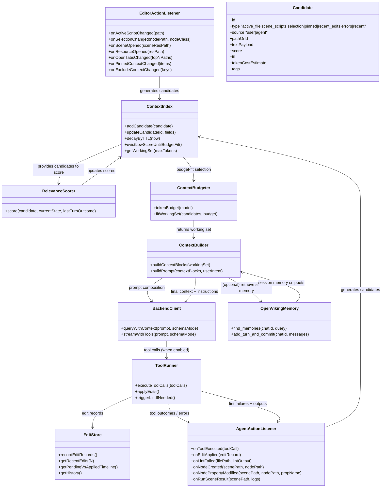
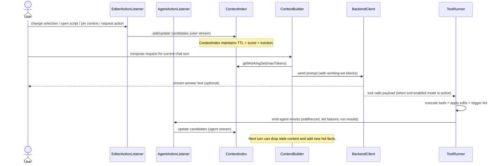

# Context Vision (Unity Agent Working Set)

## Core Idea
Maintain a continuously updated **working set** (small, relevance-scored context window) derived from:

1. **User/editor action stream** (what the user is currently doing in Unity)
2. **Agent/tool action stream** (what the agent just changed and what failed)

Then compose the prompt from the working set with strict **budgeting + eviction**.

This is conceptually aligned with OpenViking-style memory: long-lived facts come from committed chat turns, while short-lived facts come from the working set derived from recent state changes (user and agent).

---

## 1) Component / Responsibility Map (UML-style)



---

## 2) Two Action Streams -> Continuously Updated Working Set

```mermaid
flowchart TD
  A[Unity Editor: user events] --> B[EditorActionListener]
  C[Agent/tool execution events] --> D[AgentActionListener]

  B --> E[ContextIndex (working candidates)]
  D --> E

  E --> F[RelevanceScorer (score + TTL decay)]
  F --> G[ContextBudgeter (token fit + eviction)]
  G --> H[ContextBuilder (blocks: active, scene, selection, errors, recent edits)]
  H --> I[Backend Client (stream or non-stream)]
  I --> J[ToolRunner (execute + lint follow-up triggers)]
  J --> D

  %% OpenViking: longer-term memory retrieval
  K[OpenViking (session memory)] --- H : retrieved_memories (when available)
  J --> L[OpenViking commit (fire-and-forget)]
```

### Candidate types (conceptual examples)
- `active_file`: the user's currently open/edited script content (bounded, truncated, or summarized)
- `selection`: the selected node class/path and relevant hints for modifications
- `scene_scripts`: scripts attached to nodes in the currently open scene (and optionally their base-class extracts)
- `pinned_context`: user-curated context items
- `recent_edits`: agent-caused changes (file paths, diffs, node paths)
- `errors`: lint/parser/compiler diagnostics tied to file paths + failing lines
- `recent_user_activity`: open tabs, recently accessed resources

### Lazy inclusion ("send only what matters")
- Project-wide blobs (autoloads, input maps, keybindings) are often *expensive*.
- Prefer including them only when relevance signals indicate they matter.

---

## 3) Ask Turn Lifecycle (Sequence Diagram)



---

## OpenViking Integration (Where it fits conceptually)
- **Retrieve**: when composing the next prompt, fetch relevant session memory snippets for the chat id, and include them as a bounded block (e.g. `session_memory`).
- **Commit**: after the assistant responds (and/or after each tool round), add the user+assistant messages to OpenViking so it can extract longer-lived facts.

OpenViking is complementary:
- working set = short-lived, stateful facts derived from editor+tool events
- OpenViking memory = longer-lived, semantic summaries derived from committed turns

---

## Why this matters for a Unity agent (fundamentals)
In Unity, context is not just "which files exist":
- The model needs a representation of the current engine world state (scene + attached scripts + selection + relevant wiring).
- Tool execution changes the world; those changes must become context immediately.
- Context must be evicted/decayed so the model does not "fight" stale assumptions.

This design optimizes:
- continuous focus via eviction + TTL + scoring
- two-sided causality (user intent vs agent outcome)
- on-demand inclusion of expensive project-wide facts
- reliability loops: errors and edit records become the next turn's highest-signal context

